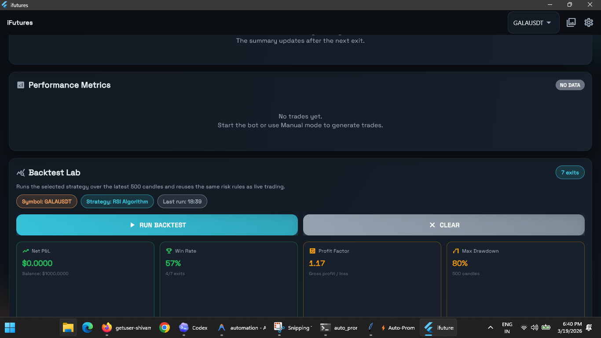
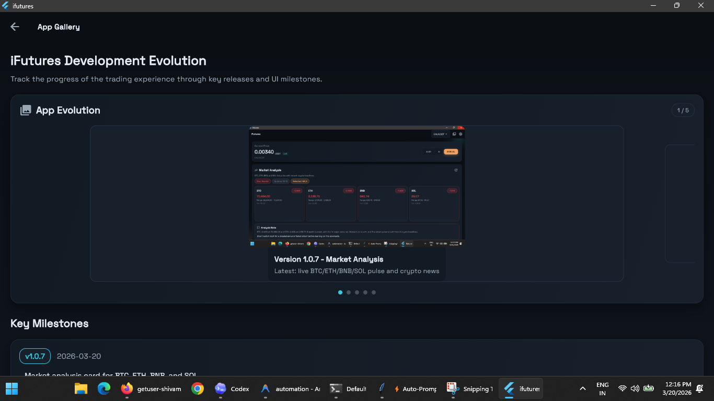

# iFutures - Automated Trading Bot

A Flutter-based trading bot application for automated cryptocurrency trading with AI and algorithmic strategies.

## Versioning

- **Current version:** `1.0.7+8` (see `pubspec.yaml`)
- **Changelog:** [CHANGELOG.md](CHANGELOG.md)
- **TODOs:** [TODO.md](TODO.md)

## Application Overview

iFutures is a multi-platform trading application that connects to Binance API and provides algorithmic, AI-driven, and manual trading modes. The app supports real-time market data visualization, live price monitoring, configurable symbols, persistent trade history, CSV export, resilient reconnects, historical backtesting, and automated bot control.

### Current Features

- **Real-time Candlestick Charts**: OHLC candlestick chart with live updates
- **Strategy Modes**: Manual-first dashboard with ALGO and AI modes available from the selector
- **Bot Control**: Start/stop trading execution
- **Configurable Symbols**: Manage the tradable symbol list from Settings
- **RSI Strategy Presets**: Tune the algorithm with saved RSI period and threshold presets
- **Risk Management**: Stop loss, take profit, and trade quantity configuration
- **Persistent Trade History**: Entry/exit trades are saved locally and restored on startup
- **App Gallery**: Built-in evolution gallery with the latest settings screenshot
- **Market Analysis Card**: Live BTC/ETH/BNB/SOL pulse from CoinGecko with Google News headlines
- **Resilient Market Stream**: WebSocket auto-reconnect with exponential backoff
- **Open Position Card**: Current position with SL/TP previews and unrealized PnL
- **Daily Performance Summary**: PnL, win rate, and drawdown for the current local day
- **Trade History**: Entry/exit trades with reasons and realized PnL
- **CSV Export**: Trade history can be exported for offline analysis
- **Backtesting Lab**: Historical candle simulation using the selected strategy and live risk rules
- **Performance Metrics**: Win rate, total PnL, drawdown, and profit factor
- **Status Indicators**: Bot running state, engine status, reconnect attempts, and strategy signal display
- **Price Alerts**: Threshold-based one-shot alerts with toast notifications and rearm controls

## Screenshots

### Windows Desktop Application

*Current state: Dashboard showing market analysis, price action, and manual controls*

### App Gallery

*Current state: App Gallery highlighting the market analysis slide and milestone card*

## Development Status

### Completed
- [x] Flutter Windows build setup
- [x] Real-time price display and WebSocket streaming
- [x] Candlestick chart (OHLC)
- [x] Strategy selection (ALGO/AI/Manual)
- [x] Bot control buttons (START/STOP)
- [x] Risk settings (SL/TP/quantity)
- [x] Paper trading with entry/exit and realized PnL
- [x] Trade history and performance metrics
- [x] Historical backtesting engine
- [x] Multi-symbol selection
- [x] Configurable symbol list in Settings
- [x] RSI strategy presets and tuning controls in Settings
- [x] App gallery refreshed with the current strategy tuning screenshot
- [x] Market analysis card with BTC, ETH, BNB, SOL, and crypto news
- [x] Persist trade history to disk and reload on startup
- [x] Clear trade history action from the dashboard
- [x] Strategy signal indicator for AI/ALGO decisions
- [x] WebSocket auto-reconnect with exponential backoff and reconnect status in the UI
- [x] Price alerts with toast notifications and rearmable dashboard cards
- [x] Daily performance summary card with PnL, win rate, and drawdown
- [x] GitHub Actions CI for `flutter analyze`, `flutter test`, and a Windows build smoke check

### Roadmap
See [TODO.md](TODO.md) for current priorities and upcoming work.

## Building and Running

### Windows
```bash
flutter build windows
flutter run -d windows
```

### macOS
```bash
flutter build macos
flutter run -d macos
```

### Linux
```bash
flutter build linux
flutter run -d linux
```

## Project Structure

```
lib/
|- main.dart                    # App entry point
|- models/
|  |- connection_status.dart    # Market connection state model
|  |- backtest_result.dart      # Backtest result data model
|  |- kline.dart                # OHLCV candlestick data model
|  |- performance_summary.dart  # Performance summary data model
|  |- price_alert.dart          # Price alert model and formatting helpers
|  |- market_analysis.dart      # Market analysis data models and formatting helpers
|  |- position.dart             # Open position model
|  |- risk_settings.dart        # Risk configuration model
|  |- rsi_strategy_preset.dart  # RSI preset definitions and helpers
|  |- trade.dart                # Trade record model
|- constants/
|  |- symbols.dart              # Default tradable symbols
|- providers/
|  |- trading_provider.dart     # Riverpod state management
|- screens/
|  |- dashboard_screen.dart     # Main trading dashboard
|  |- settings_screen.dart      # Configuration screen
|  |- gallery_screen.dart       # App gallery
|- services/
|  |- binance_api.dart          # Binance REST API client
|  |- backtest_service.dart     # Historical strategy simulation engine
|  |- binance_ws.dart           # Binance WebSocket connection
|  |- market_analysis_service.dart # Live BTC/ETH/BNB/SOL analysis and crypto news feed
|  |- reconnect_backoff.dart    # Exponential retry delay helper
|  |- reconnecting_websocket.dart # Resilient WebSocket wrapper
|  |- performance_summary_calculator.dart # Shared performance summary logic
|  |- price_alert_service.dart   # Persistent alert storage and evaluation
|  |- settings_service.dart     # Settings storage
|  |- trade_csv_export_service.dart # CSV export helper for trade history
|  |- trade_history_service.dart # Local trade history persistence
|- trading/
|  |- strategy.dart             # Strategy interface
|  |- ai_strategy.dart          # AI-powered strategy
|  |- algo_strategy.dart        # Algorithmic strategy
|  |- manual_strategy.dart      # Manual strategy placeholder
|  |- trading_engine.dart       # Main execution engine
|- widgets/
|  |- common/
|  |  |- action_button.dart     # Reusable dashboard button
|  |  |- app_panel.dart         # Shared panel container
|  |  |- app_toast.dart         # Shared floating snackbar helper
|  |  |- status_pill.dart       # Compact status badge
|  |- dashboard/
|  |  |- daily_performance_card.dart # Daily realized PnL summary
|  |  |- backtest_card.dart       # Historical backtest dashboard card
|  |  |- market_analysis_card.dart # Live BTC/ETH/BNB/SOL analysis and crypto news
|  |  |- mode_selector.dart       # Strategy mode toggle
|  |  |- open_position_card.dart  # Open position summary
|  |  |- price_alert_listener.dart # Dashboard alert toast listener
|  |  |- price_alerts_card.dart   # Alert creation and management card
|  |  |- price_chart.dart         # Candlestick chart visualization
|  |  |- performance_metrics.dart # Realized PnL metrics
|  |  |- trade_history.dart       # Trade history list
|  |- gallery/
|  |  |- screenshot_carousel.dart # App evolution carousel
```

## Dependencies

Key packages used:
- **flutter_riverpod**: State management
- **http & dio**: HTTP clients for API calls
- **web_socket_channel**: WebSocket connections
- **fl_chart**: Financial charts
- **flutter_secure_storage**: Secure credential storage
- **shared_preferences**: Local settings storage
- **intl**: Internationalization
- **crypto**: Cryptographic functions for API signing

## Getting Started

This project requires Flutter 3.x and Dart 3.x.

For help getting started with Flutter development, view the
[online documentation](https://docs.flutter.dev/), which offers tutorials,
samples, guidance on mobile development, and a full API reference.
