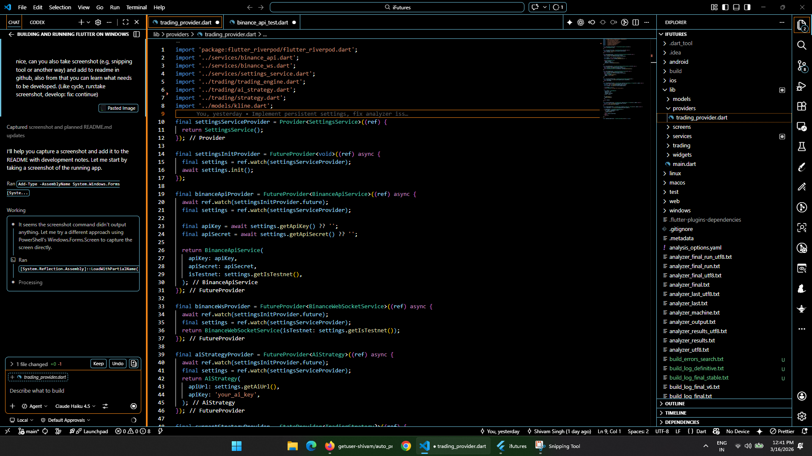

# iFutures - Automated Trading Bot

A Flutter-based trading bot application for automated cryptocurrency trading with AI and algorithmic strategies.

## Application Overview

iFutures is a multi-platform trading application that connects to Binance API and provides both algorithmic and AI-powered trading strategies. The app supports real-time market data visualization, live price monitoring, and automated bot control.

### Current Features
- **Real-time Price Charts**: Live candlestick charts with market insights
- **Strategy Selection**: Switch between ALGO and AI trading modes
- **Bot Control**: Start/stop bot execution
- **Market Data**: GALAUSDT and other trading pair monitoring
- **Settings Management**: API key configuration and testnet toggle

## Screenshots

### Windows Desktop Application

*Current state: App showing live GALAUSDT price at 0.00363 USDT with strategy selector and bot controls*

## Development Status & Tasks

### ✅ Completed
- [x] Flutter Windows build setup
- [x] Basic dashboard UI layout
- [x] Price chart widget (fl_chart integration)
- [x] API key/secret storage (flutter_secure_storage)
- [x] Strategy mode selector (ALGO/AI)
- [x] Bot control buttons

### 🔄 In Progress / TODO
- [ ] **Bot Status Display**: Show real-time bot execution status
- [ ] **Trade History**: Display completed trades with entry/exit prices
- [ ] **Performance Metrics**: Win rate, total P&L, Sharpe ratio
- [ ] **Risk Management**: Stop loss, take profit configuration
- [ ] **WebSocket Integration**: Ensure real-time price updates working
- [ ] **Binance API Connection**: Test live API calls
- [ ] **AI Strategy Implementation**: Complete AI model integration
- [ ] **Algo Strategy Logic**: Implement algorithmic trading rules
- [ ] **Settings UI**: API configuration interface
- [ ] **Error Handling**: Network errors, API failures
- [ ] **Notifications**: Trade alerts and warnings
- [ ] **Data Persistence**: Save bot state between sessions
- [ ] **Mobile Support**: iOS/Android builds
- [ ] **Testing**: Unit and widget tests

## Building and Running

### Windows
```bash
flutter build windows
flutter run -d windows
```

### macOS
```bash
flutter build macos
flutter run -d macos
```

### Linux
```bash
flutter build linux
flutter run -d linux
```

## Project Structure

```
lib/
├── main.dart                    # App entry point
├── models/
│   └── kline.dart              # OHLCV candlestick data model
├── providers/
│   └── trading_provider.dart    # Riverpod state management
├── screens/
│   ├── dashboard_screen.dart    # Main trading dashboard
│   └── settings_screen.dart     # Configuration screen
├── services/
│   ├── binance_api.dart         # Binance REST API client
│   ├── binance_ws.dart          # Binance WebSocket connection
│   └── settings_service.dart    # Settings storage
├── trading/
│   ├── strategy.dart            # Strategy interface
│   ├── ai_strategy.dart         # AI-powered strategy
│   ├── algo_strategy.dart       # Algorithmic strategy
│   └── trading_engine.dart      # Main execution engine
└── widgets/
    ├── mode_selector.dart       # Strategy mode toggle
    ├── price_chart.dart         # Chart visualization
    └── ...                       # Other UI components
```

## Dependencies

Key packages used:
- **flutter_riverpod**: State management
- **http & dio**: HTTP clients for API calls
- **web_socket_channel**: WebSocket connections
- **fl_chart**: Financial charts
- **flutter_secure_storage**: Secure credential storage
- **shared_preferences**: Local settings storage
- **intl**: Internationalization
- **crypto**: Cryptographic functions for API signing

## Getting Started

This project requires Flutter 3.x and Dart 3.x.

For help getting started with Flutter development, view the
[online documentation](https://docs.flutter.dev/), which offers tutorials,
samples, guidance on mobile development, and a full API reference.
